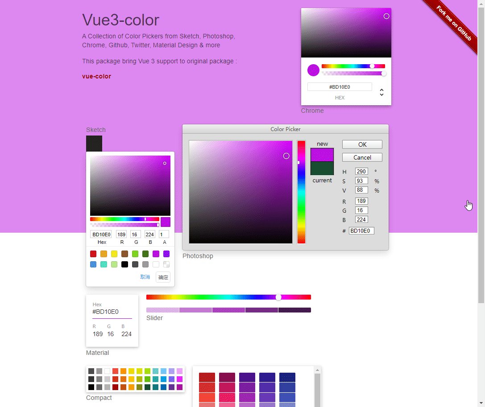

# vue3-color


Color Pickers for Sketch, Photoshop, Chrome & more with Vue 3.

This package bring Vue 3 support to original package : [vue-color](https://www.npmjs.com/package/vue-color)

## [Live demo](https://Ans1998.github.io/vue3-color/)



## Installation

### NPM
```bash
$ npm i @ans1998/vue3-color
```

### 使用
``` js

<div>
  <h2>Sketch</h2>
  <div style="width: 40px; height: 40px; cursor: pointer" :style="{backgroundColor: sketchBgColor}" @click="changSketch"></div>
  <Sketch v-model="colors" :show="showSketch" @changButton="changSketchButton"></Sketch>
</div>

import { Sketch } from '@ans1998/vue3-color'

/** 
let item = {
    isOk: true,
    activeColor: '',
    hex: ''
}
*/
components: {
  Sketch
}

data () {
  return {
    colors: "",
    sketchBgColor: "#222",
    showSketch: true
  }
}

changSketchButton (item) {
  this.showSketch = false
  console.log(item)
  if (item.isOk) {
    console.log('确定')
    this.sketchBgColor = item.activeColor
  } else {
    console.log('取消')
  }
}
```

### ts
```
shims-vue.d.ts
/* eslint-disable */
declare module '*.vue' {
  import type, { DefineComponent } from 'vue'
  const component: DefineComponent<{}, {}, any>
  export default component
}
declare module '@ans1998/vue3-color'
```

## 说明
基于@lk77的项目进行二开

## License

@ans1998/vue3-color is licensed under [The MIT License](LICENSE).
